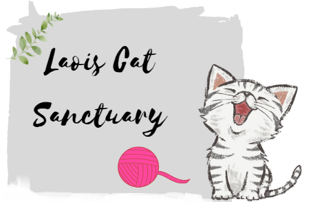

<h1>Site description</h1>
This website was designed and built for educational practice and is about a fictional cat shelter - Laois Cat Sancturary, the idea of which was created for the purpose of this project. The website is to enable users to find information about the shelter's profile, scope of activities, animals in their care and location. The purpose is also to encourage new volunteers to sign up and support the shelter. It's a static, responsive website built with HTML & CSS as basic technologies at this time, further features can be added at later time with Javascript and a database.  

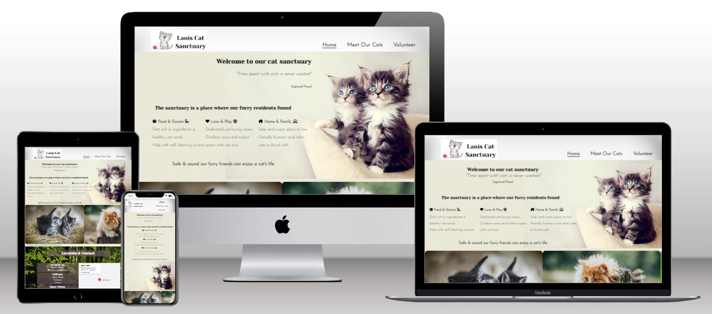

<h1>Features</h1> 
<h2>Site wide</h2>
<ul>
    <li><h3>Favicon</h3></li>
    Cat favicon will help the user identify the website quickly, when having multiple tabs open in the browser.
    
</ul>

 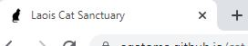 

<ul>
    <li><h3>Customized mouse cursor hover over links</h3></li>
    When hovering over links the mouse coursor takes on the shape of an animal paw, which makes the feel of the website more cat like and helps the user get into the right mood. 
</ul>
   
 

<ul>
    <li><h3>Navigation menu in the header</h3></li>
    The responsive navigation menu contains links to Home, Meet the cats (gallery page) and Volunteer (Signup form page), which enables the user to easily navigate between pages from any of them. The active class helps to orientate the user on the current location (page). 
</ul>

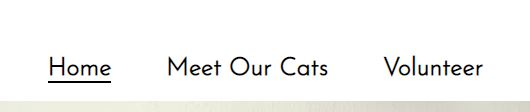

<ul>
    <li><h3>Social media links in the footer</h3></li>
    Social media links in the form of well known brand icons of Facebook, Youtube and Instagram can be access from any page on the site. When clicked they open in a separate browser window, which enables the user to open more than one site at the same time.  
</ul>
    
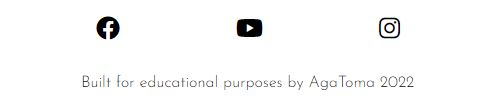 

<h2>Landing page - Home</h2>
<ul>
    <li><h3>About text and photo</h3></li>
    This section provides description of what the sanctuary's purpose and scope of activities. It also contains an image of blue eyed cats to add impact to the message. 
</ul>

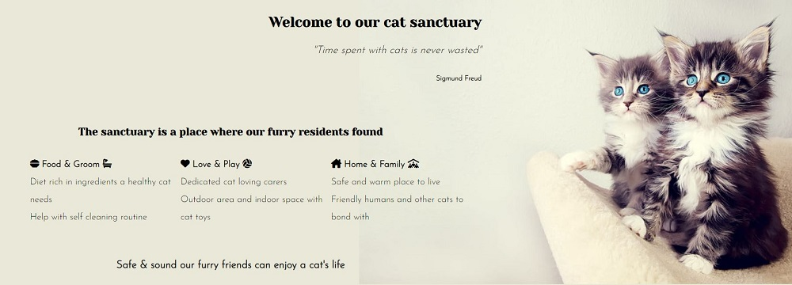

<ul>
    <li><h3>Scrollbar with images & video</h3></li>
    Scrollbar with four images and a video provides a user controlled experience, where user can get further context around cat's life in the shelter. The video is fully user controlled - can be expanded to be viewed in full screen mode, muted, played, paused stopped by the user. In future deployments scrollbar can potentially be replaced with a bootstrap carousel for even better visual experience.
</ul>

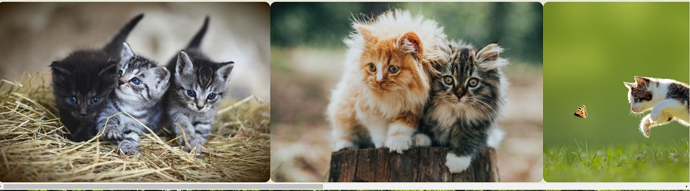
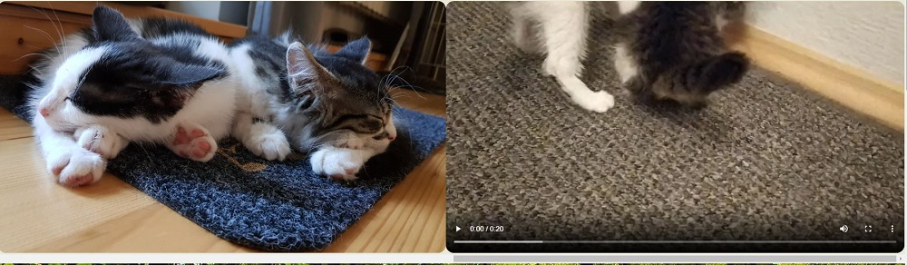

<ul>
    <li><h3>Location section</h3></li>
    Location section provides the user with contact information, address and open times schedule, so that the user can easily contact or find the sanctuary. It contains the below features for better user experience:
    <ul>
        <li><h4>Direct call feature (href="tel: telephonenumber")</h4></li>
        This feature is especially useful for mobile users, who can call the sanctuary directly by clicking the phone number from the locaton section. When user hovers over the phone number is highlighted and coursor changes to a paw to let user know that action is available. 
    </ul>
    <ul>
        <li><h4>Direct email feature (href="mailto: emailaddress")</h4></li>
        This feature is especially useful for users, who want to be able to quickly open email message editor with sanctuary's address preinserted for convenience. When user hovers over the email address is highlighted and coursor changes to a paw to let user know that action is available. 
    </ul>
    <ul>
        <li><h4>Google map</h4></li>
        User is able to see the location on an embedded google map. Google map has +/- buttons for user to scale it for their convenience, it also has "View larger map" option, which when clicked opens the map in a separate tab providing user the option to use further google map features. There is also a direct link for "Directions", which again open google maps in a separate browser tab, where user can get
    </ul>
</ul>

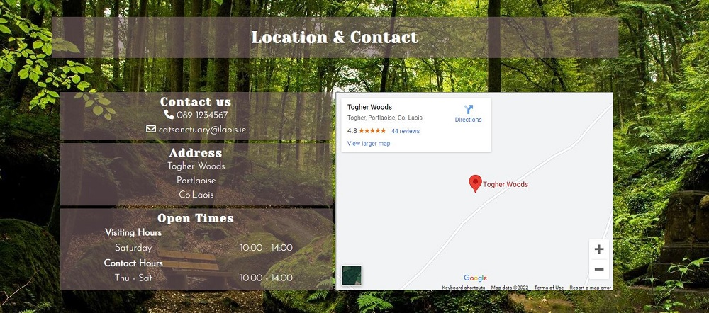
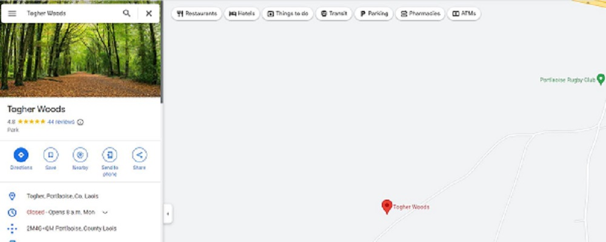
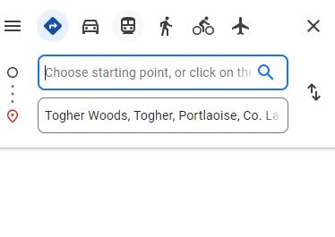

<h2>Gallery - Meet the cats</h2>
The gallery provides user the opportunity to individually see the cats living in the shelter and get to know them a bit better by seeing their images along with their names and short description with the ultimate purpose of encouraging the user to come to the sanctuary and visit the cat they particularly like. In future deployments "Meet Me" and "Adopt Me" buttons linked to forms and a database would be added to enhance this experience and call user to action in an even more impactful way.

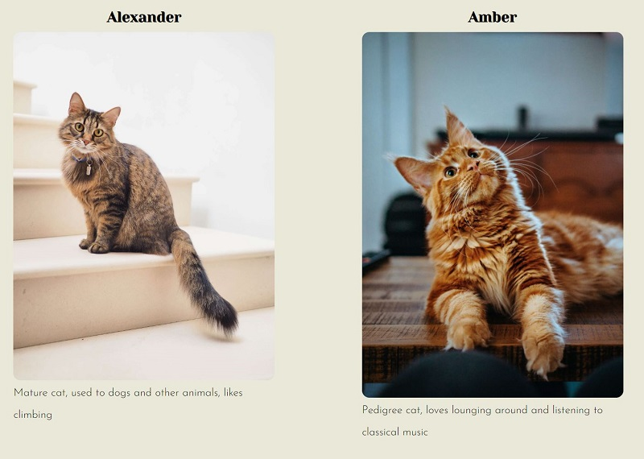

<h2>Sign up form - Volunteer</h2>
The responsive sign up form allows users to enter their contact information and role preferences. It consists of two fieldsets with the below fields:
<ul>
    <li><h3>Fieldset for personal details </h3></li>
        <ul>
            <li><h4>Name</h4></li>
            Required field, input type = text
            <li><h4>Email</h4></li>
            Required field, input type = email
            <li><h4>Phone</h4></li>
            Required field, input type = phone
        </ul>
    <li><h3>Fieldset for volunteering preferences</h3></li>
        3 radio buttons allow user to select what type of role they volunteer for
        <ul>
            <li><h4>Carer</h4></li>
            When hovering over the word "Carer" a short description of the role is displayed
            <li><h4>Admin</h4></li>
            When hovering over the word "Admin" a short description of the role is displayed
            <li><h4>Both</h4></li>
            <li><h4>Comments field </h4></li>
            Voluntary field, input is not required
        </ul>
<ul>
   If user doesn't fillout the required fields or inputs data in a wrong format, they will not be able to submit the form
   Upon submitting the form is redirected to Code Institute form dump site, where a set of submitted data is displayed. In future deployments this would be replaced by a "Thank you" page and user data would be sent to a database.  

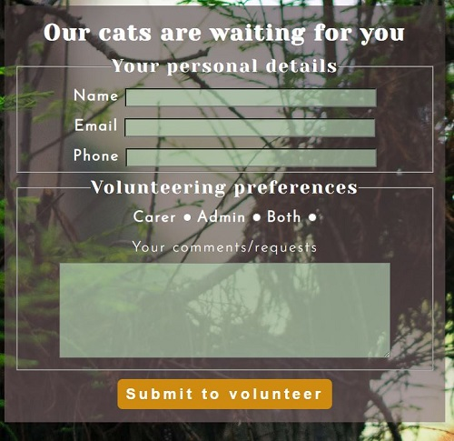

<h2>Current features summary</h2>

responsive design, customized cursor, photo/video scroll section, responsive sign up form 

<h2>Features to be developed in future deployments</h2>

Bootstrap carousel instead of horizontal scroll bar
Adopt me & Meet me buttons for gallery
Newsletter signup for events, needed donations etc. 

<h1>Design</h1>

add photos of notebook sketches

<h1>Technologies</h1>
<ul>
    <li>HTML</li>
    The structure of the Website was developed using HTML as the main language.
    <li>CSS</li>
    The Website was styled using custom CSS in an external file.
    <li>Gitpod</li>
    The website was developed using Gitpod in Chrome
    <li>GitHub</li>
    Source code is hosted on GitHub and deployed using Git Pages.
    <li>Git</li>
    Used to commit and push code during the development of the Website
    <li>Font Awesome</li>
    Icons used on Home page & favicon were from https://fontawesome.com/ 
    <li>Tinyjpg</li>
    https://tinyjpg.com/ was used to reduce the size of the images 
    <li>Canva</li>
    Logo was created using https://www.canva.com/
    <li>Colormind</li>
    Color pallette was generated with http://colormind.io/ 
    <li>Convertio</li>
    JPG format gallery photos were converted to webp using https://convertio.co/jpg-webp/ 
</ul>

<h1>Testing</h1> 
<h2>Responsiveness</h2>

Website was developed and tested for responsiveness using Developer Tools in Chrome. To ensure optimal website look for best user experience for screen sizes starting from 320px the below wiewport size breakpoints were applied:

<ul>
    <li>above 1500px</li>
    <li>1400px - 1500px</li>
    <li>1000px - 1399px</li>
    <li>1000px - 1399px</li>
    <li>650px - 999px</li>
    <li>751px - 999px - for signup form only</li>
    <li>430px - 651px</li>
    <li>320px - 430px</li>
</ul>

Testing was done by applying breakpoints in the Dimensions section by setting it to responsive. To ensure the website's look is as desired between the breakpoints, the responsive testing window was manually dragged to increase/decrease width.

<h3>Expected behaviour:</h3>
Website is responsive on all screen sizes with photos not being pixelated or stretched, no scrollbars are appearing except for the one in the design. 

<h3>Actual behaviour:</h3>
As expected.

<h3>Devices the site was tested on for responsiveness (no issues found)</h3>

Asus E406M + external Dell monitor

Asus E406M

Dell Latitute 5400

Lenovo Tab M10

iPhone XR

Samsung Galaxy 8+

<h4>Browsers: Chrome, Edge, Firefox, Safari</h4>

<h2>Accessibility</h2>

Tested with [Wave](https://wave.webaim.org/) - Web Accessibility Evaluation Tool.

Care was taken throughout the project to ensure accessibility via

<ul>
    <li>aria labels were added to all external links</li>
    <li>alternative text was added to non backround images</li>
    <li>description was added between video tags</li>
    <li>using a balanced color pallette to ensure user friendly contrast</li>
</ul>

During testing of the completed signup form and error was found where orange submit button combined with white bold text was not meeting contrast criteria, this was fixed by changing button color to darker green, after which the button passed the accessibility test.

No other errors were found

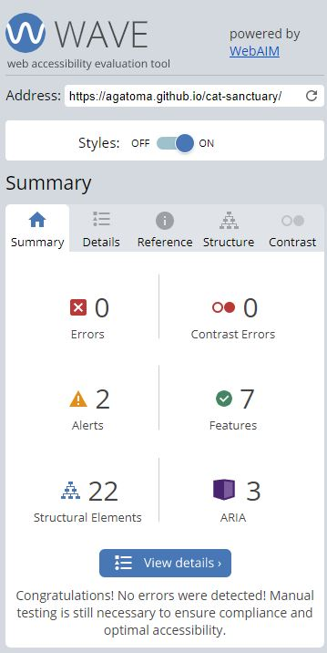
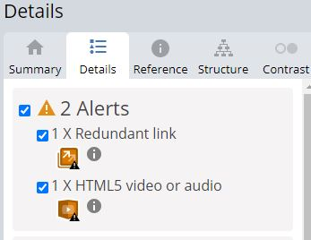

There are 2 alerts showing, however

<ol>
    <li>It is intent of the author to have the home page link present both under logo and on the navbar</li>
    <li>There is only background music in the video and description was added between the video tags</li>
</ol>

<h2>Lighthouse testing</h2>

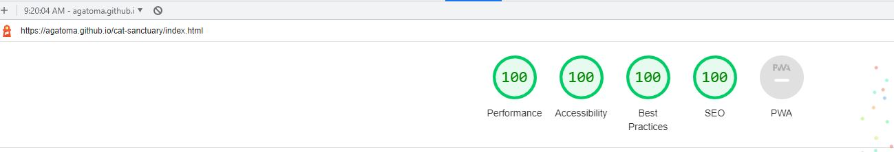

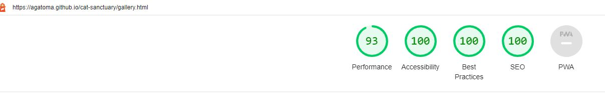

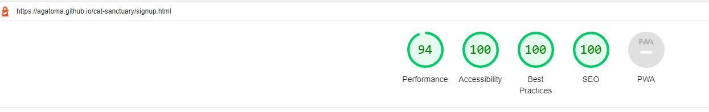

<h2>Functional testing</h2>

[Document can be viewed here](https://docs.google.com/spreadsheets/d/1P0aYNtvpA9QDwnZXACqm3CdlsmWsdYgggPdPFDCIM2Q/edit?usp=sharing)

<h3>Fixes applied during final functional testing</h3>

Fix1 - Homepage - Resized About section to ensure carousel scrollbar is not hidden behing Location section content

Fix2 - Volunteer form - Required value was missing from Role selection radio options - added required

<h2>Validator testing</h2>

<h3>HTML</h3>

Website was tested with [W3C validator](https://validator.w3.org/).

Initially, the following results were returned for index.html:
<ol>
    <li>Error: Unordered list on lines 51, 62, 73 were wrapped in paragraph tags. Fix: paragraph tags were removed and desired styling was applied via CSS.</li>
    <li>Alert: Table headings from address table in location section were not in the same table rows. Fix: moved second table heading to the same row as first table heading</li>
</ol> 

Test was rerun and returned the following results without errors and alerts for all pages on the site

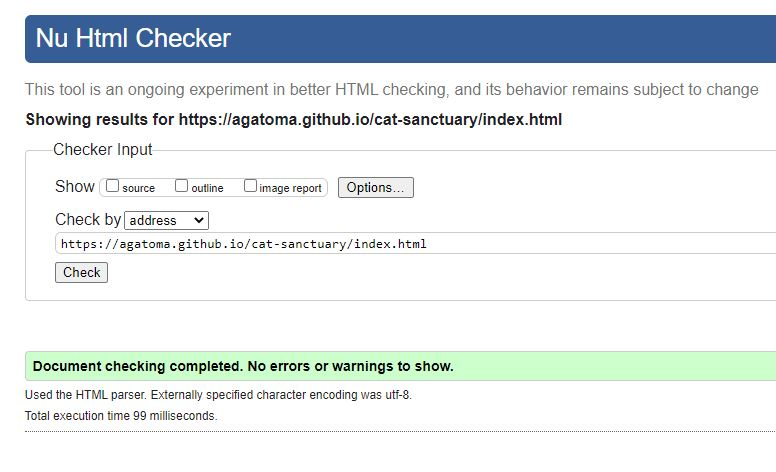
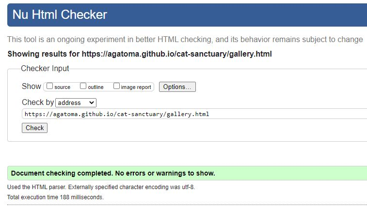
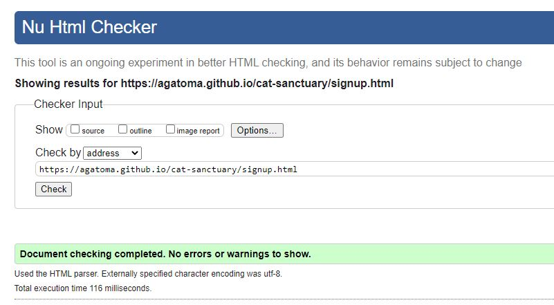

<h3>CSS</h3>

Website was tested with [W3C jigsaw validator](https://jigsaw.w3.org/css-validator/). No errors were returned. 

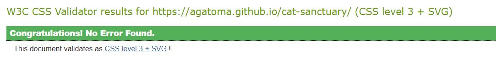

<h1>Deployment</h1>

<h1>Credits</h1>
<h2>References</h2>
Used the below resources for reference and help.
<h3>Navbar menu</h3>
https://dev.to/jungjungie/create-a-navbar-with-css-flexbox-2leh  
https://www.w3schools.com/css/css_navbar_horizontal.asp
<h3>Custom mouse coursor</h3>
https://blog.logrocket.com/creating-custom-mouse-cursor-css/  
https://www.w3schools.com/CSSref/pr_class_cursor.php
<h3>General</h3>
Stack Overflow  
https://www.w3schools.com/css/  
https://developer.mozilla.org/en-US/docs/Web/CSS/

<h2>Content</h2>
Content of the website is fictional and was created for educational purposes of building the website by it's author (Aga Tomaszewska)

<h2>Media</h2>
Photos were taken from unsplash & pexels (free to use) & own resources (sleeping-cats.jpg).
Permission to use the video was obtained from the author Magda Muras. 