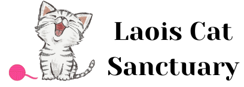
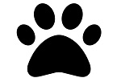

<h1>Site description</h1>
This website was designed and built for educational practice and is about a fictional cat shelter - Laois Cat Sancturary, the idea of which was created for the purpose of this project. The website is to enable users to find information about the shelter's profile, scope of activities, animals in their care and location. The purpose is also to encourage new volunteers to sign up and support the shelter. It's a static, responsive website built with HTML & CSS as basic technologies at this time, further features can be added at later time with Javascript and a database.  

<h1>Features</h1> 
<h2>Site wide</h2>
<ul>
    <li><h3>Favicon</h3></li>
    Cat favicon will help the user identify the website quickly, when having multiple tabs open in the browser.
    
</ul>

  

<ul>
    <li><h3>Customized mouse cursor hover over links</h3></li>
    When hovering over links the mouse coursor takes on the shape of an animal paw, which makes the feel of the website more cat like and helps the user get into the right mood. 
</ul>
   
 

<ul>
    <li><h3>Navigation menu in the header</h3></li>
    The responsive navigation menu contains links to Home, Meet the cats (gallery page) and Volunteer (Signup form page), which enables the user to easily navigate between pages from any of them. The active class helps to orientate the user on the current location (page). 
</ul>

<ul>
    <li><h3>Social media links in the footer</h3></li>
    Social media links in the form of well known brand icons of Facebook, Youtube and Instagram can be access from any page on the site. When clicked they open in a separate browser window, which enables the user to open more than one site at the same time.  
</ul>
    
 

<h2>Landing page - Home</h2>
<ul>
    <li><h3>About text and photo</h3></li>
    This section provides description of what the sanctuary's purpose and scope of activities. It also contains an image of blue eyed cats to add impact to the message. 
</ul>

<ul>
    <li><h3>Scrollbar with images & video</h3></li>
    Scrollbar with four images and a video provides a user controlled experience, where user can get further context around cat's life in the shelter. The video is fully user controlled - can be expanded to be viewed in full screen mode, muted, played, paused stopped by the user. In future deployments scrollbar can potentially be replaced with a bootstrap carousel for even better visual experience.
</ul>

<ul>
    <li><h3>Location section</h3></li>
    Location section provides the user with contact information, address and open times schedule, so that the user can easily contact or find the sanctuary. It contains the below features for better user experience:
    <ul>
        <li><h4>Direct call feature (href="tel: telephonenumber")</h4></li>
        This feature is especially useful for mobile users, who can call the sanctuary directly by clicking the phone number from the locaton section. When user hovers over the phone number is highlighted and coursor changes to a paw to let user know that action is available. 
    </ul>
    <ul>
        <li><h4>Direct email feature (href="mailto: emailaddress")</h4></li>
        This feature is especially useful for users, who want to be able to quickly open email message editor with sanctuary's address preinserted for convenience. When user hovers over the email address is highlighted and coursor changes to a paw to let user know that action is available. 
    </ul>
    <ul>
        <li><h4>Google map</h4></li>
        User is able to see the location on an embedded google map. Google map has +/- buttons for user to scale it for their convenience, it also has "View larger map" option, which when clicked opens the map in a separate tab providing user the option to use further google map features. There is also a direct link for "Directions", which again open google maps in a separate browser tab, where user can get
    </ul>
</ul>

<h2>Gallery - Meet the cats</h2>
The gallery provides user the opportunity to individually see the cats living in the shelter and get to know them a bit better by seeing their images along with their names and short description with the ultimate purpose of encouraging the user to come to the sanctuary and visit the cat they particularly like. In future deployments "Meet Me" and "Adopt Me" buttons linked to forms and a database would be added to enhance this experience and call user to action in an even more impactful way.

<h2>Sign up form - Volunteer</h2>
(description, form features)

Features summary - responsive design, customized cursor, photo/video scroll section, responsive sign up form 

Features to be developed in future deployments
Bootstrap carousel instead of horizontal scroll bar
Adopt me & Meet me buttons for gallery
Newsletter signup for events, needed donations etc. 

Design - add photos of notebook sketches

Technologies
HTML
The structure of the Website was developed using HTML as the main language.
CSS
The Website was styled using custom CSS in an external file.
Gitpod
The website was developed using Gitpod in Chrome
GitHub
Source code is hosted on GitHub and delpoyed using Git Pages.
Git
Used to commit and push code during the development opf the Website
Font Awesome
Icons used on Home page & favicon were from https://fontawesome.com/ 
Tinyjpg
https://tinyjpg.com/ was used to reduce the size of the images used throughout the website
Canva
Logo was created using https://www.canva.com/
Color palette
Color pallette was generated with http://colormind.io/ 

Testing (Accessibility, SEO)

Credits
Navbar menu reference:
https://dev.to/jungjungie/create-a-navbar-with-css-flexbox-2leh 
https://www.w3schools.com/css/css_navbar_horizontal.asp
Custom mouse coursor:
https://blog.logrocket.com/creating-custom-mouse-cursor-css/
https://www.w3schools.com/CSSref/pr_class_cursor.php

Lenovo Tab M10

Content
Content of the website is fictional and was created for educational purposes of building the website by it's author (Aga Tomaszewska)

Media
Photos were taken from unsplash & pexels (free to use) & own resources (sleeping-cats.jpg).
Permission to use the video was obtained from the author Magda Muras. 